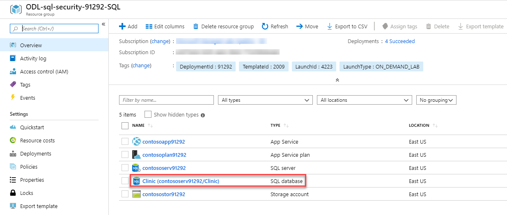
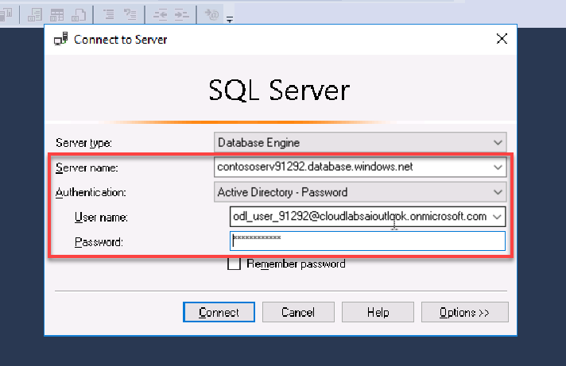

## Exercise 1: Perform database assessments

### Task 1: Review Azure SQL Database

1. In the Azure Portal, navigate to the Resource Group with suffix **-SQL**, locate a resource named **Clinic**. This is your **Azure SQL Database**.

## Exercise 2: Control Access

### Task 1: Configure Azure AD Login for your Azure SQL DB

1. Login into the Azure Portal, open **Resource Group** with suffix **-SQL**, navigate to the SQL Server.
1. Under the **Settings** blade, select **Active Directory Admin**. Here you can review your username registered as Active Directory Admin.

### Task 2: Access the Database using SQL Server Management Studio

1. Now, login to **JumpVM** by clicking on **GO TO LAB VM** button on lab details page. On start bar, search SQL and select **Microsoft SQL Server Management Studio 18**.

1. Use the following configurations then click Connect:
Server name: enter the server name which you can copy from the overview page of SQL Server at the top right corner.

authentication method: from dropdown select Active Directory-Password
username: **odl_user_xxxxx@xxxxxxxxxxx.onmicrosoft.com**
password: **arno32QCO*R1**

**iii.	You will get a login failure which will be due to the Firewall rules Image
iv.	Go back to SQL server, under security blade select Firewalls and virtual networks.?????
v.	Should we show a login failure first and then add firewall IP? 
vi.	Show the login failure due to firewall then add the rule.**

## Exercise 3: Protect Data 

### Task 1: Transparent Data Encryption 

Transparent data encryption (TDE) helps protect Azure SQL Database against the threat of malicious offline activity by encrypting data at rest. It performs real-time encryption and decryption of the database, associated backups, and transaction log files at rest without requiring changes to the application

1. In the Azure Portal, go to Resource Group with suffix **-SQL**, select the SQL Database **Clinic**.
1. Select **Transparent data encryption** under the Security blade.
1. Here you can review; transparent data encryption is already enabled. 

### Task 2: Auditing 

1. In SQL Database, under Settings select **Auditing** where you can review that Auditing is enabled and data is being stored in your storage account.
1. Click on **View Audit Logs**, this will show all the database activities happened recently.

### Task 3: Threat Protection 
1. Open Resource Group with suffix **-SQL**, navigate to the SQL Server. Select **Advanced Data Security** under Security.
1. Use the following configurations:
Advanced Data Security: **On**
Subscription: **Choose your subscription**
Storage Account: **Choose your storage account**
Periodic recurring scans: **On**
Send scan reports to: **username**
Send Alerts to: **username**
1. Select **Save**.

### Task 4: Configure SQL Data Discovery and Classification

In this task, you will look at the SQL Data Discovery and Classification feature that introduces a new tool for discovering, classifying, labeling & reporting the sensitive data in your databases. It introduces a set of advanced services, forming a new SQL Information Protection paradigm aimed at protecting the data in your database.

1.	Go to SQL Database, On the **Advanced Data Security** blade, select the **Data Discovery & Classification** tile.

2.	In the Data Discovery & Classification blade, select the info link with the message **We have found 16 columns with classification recommendations**.
3.	Look over the list of recommendations to get a better understanding of the types of data and classifications that can be assigned, based on the built-in classification settings.
4.	Check the Select all check box at the top of the list to select all the remaining recommended classifications, and then select **Accept selected recommendations**.
5.	When the save completes, select the **Overview** tab on the Data Discovery & Classification blade to view a report with a full summary of the database classification state.
6.	image to be taken

7.	**Verify by running SQL Query**

### Task 6: Simulate Attack 

1.	In the Azure Portal, open Resource Group with suffix **-SQL**, navigate to the app service **contosoapp-suffix**.
2.	Select browse, you will be directed to **Contoso Clinic** webpage.	
3.	Go to **Patients**, select **SQLi Hints**.
4.	You will see SQL ingestions that will result into an attack.
5.	Pick one of them and paste in the search box and select Search.
6.	Go to SQL Database **Clinic**, select **Advanced Data Security** under Security blade.
7.	Select **Advanced Threat Protection**, where you can review the alert , also this will be shown as a threat. It will take few minutes to get fetched.

