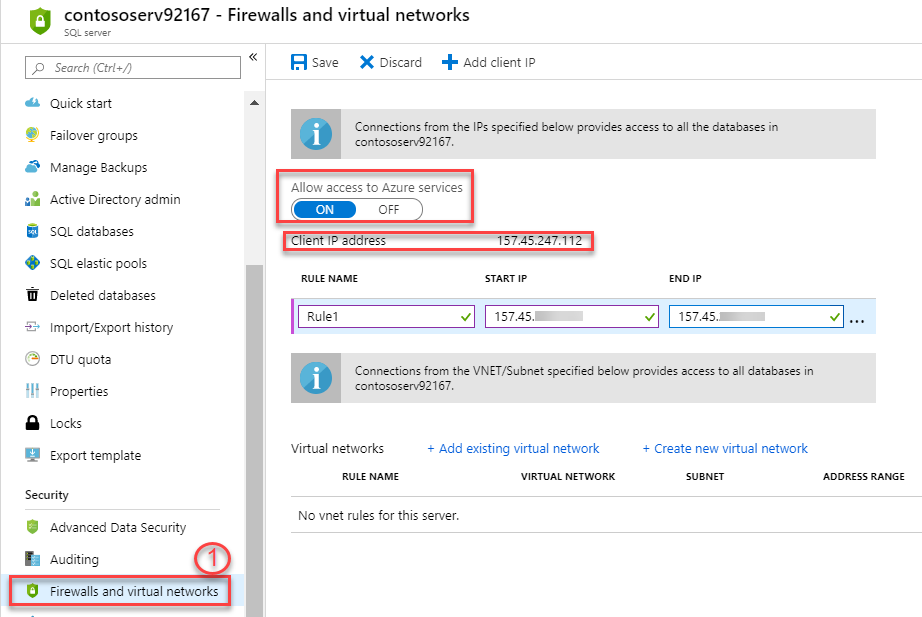
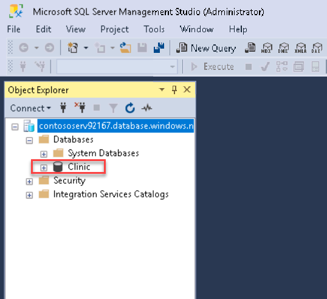

## Exercise 2: Control Access

### Task 1: Configure Azure AD Login for your Azure SQL DB

1. Login into the Azure Portal, open **Resource Group** with suffix **-SQL**, navigate to the SQL Server **contososerv-suffix**.
1. Under the **Settings** blade, select **Active Directory Admin**. Here you can review your username registered as Active Directory Admin.

### Task 2: Access the Database using SQL Server Management Studio

1. Now, login to **JumpVM** by clicking on **GO TO JumpVM** button on lab details page. 

2. On start bar, search SQL and select **Microsoft SQL Server Management Studio 18**.
3. Use the following configurations then click Connect:
* Server name: enter the server name which you can copy from the overview page of SQL Server at the top right corner.

* authentication method: from dropdown select **Active Directory-Password**
* username: **odl_user_xxxxx@xxxxxxxxxxx.xxxxxxxxxxx.com**
* password: **arno32QCO*R1**

4.	You will get a login failure which will state: ***Your client IP address does not have access to the server. Sign in to an Azure Account and create a new firewall rule to enable access.***

5. Then go back to your SQL Server **contososerv-suffix**.
6. Select **Firewall and virtual networks**. Then select **ON** for **Allow Access to Azure Services** to enable firwall, then add fiirwall IP that ranges between the **Client IP address** you see in you sql server. 

7. **Save** the changes.

8. Now go back to **JumpVM** and login again, you will get login succesfully. Also you can review you SQL Database **Clinic** by expanding **Database** 

