## Exercise 3: Protect Data 

### Task 1: Transparent Data Encryption 

Transparent data encryption (TDE) helps protect Azure SQL Database against the threat of malicious offline activity by encrypting data at rest. It performs real-time encryption and decryption of the database, associated backups, and transaction log files at rest without requiring changes to the application

1. In the Azure Portal, go to Resource Group with suffix **-SQL**, select the SQL Database **Clinic**.
2. Select **Transparent data encryption** under the **Security** blade.
3. Here you can review; transparent data encryption is already enabled. 

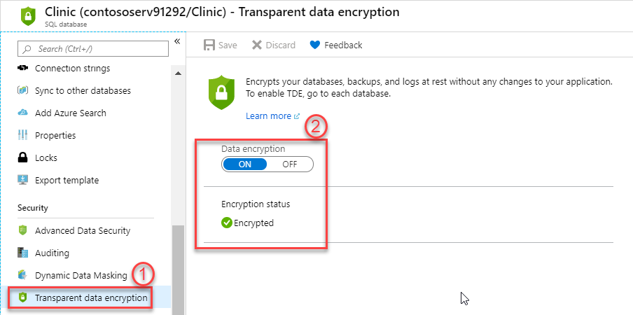

### Task 2: Always Encrypted
1. Go to **JumpVM**, then select your database **Clinic** > **Tables** > **dbo.Patients** > **Encrypt Columns**.

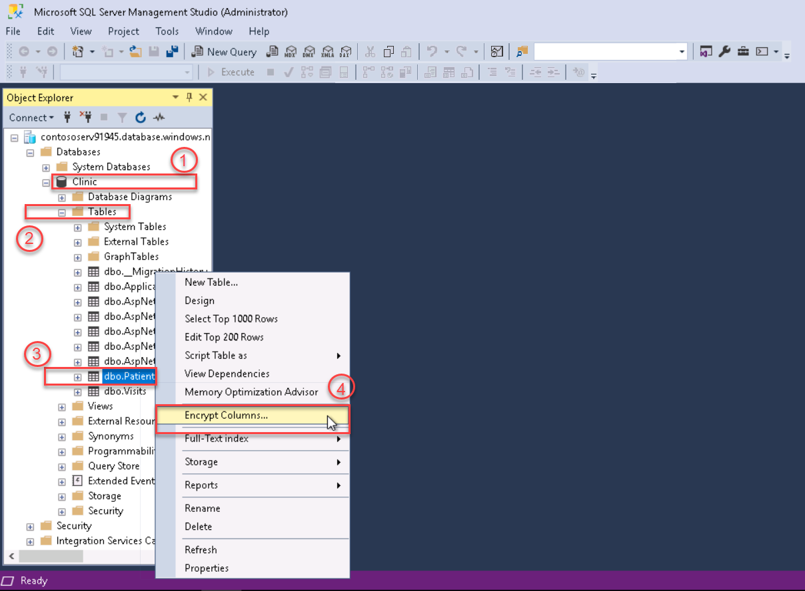

2. You will get a pop-up window, where you will enable encryption. So select **Next**.

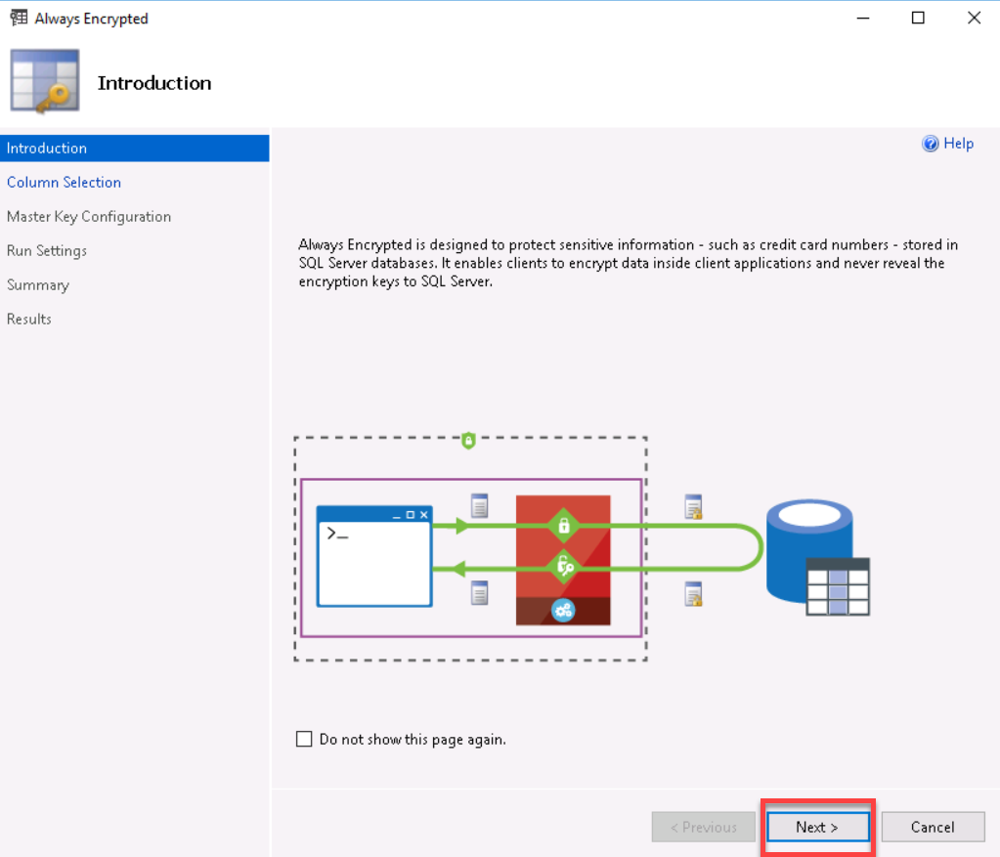

3. Check the box for **Birth Date** and for **choose type** select **Randomized*.

4. Select **Next**. On next step, select **Azure Key Vault** and then click on **sign in** button.

5. An authentication window will appear on the screen. Enter you username and password there.

img

6. Next, select the Key Vault provided you in resource group **-SQL** from the dropdown.

### Task 3: Auditing
1. In SQL Database, select **Auditing** under **Security** where you can review that Auditing is enabled and data is being stored in your storage account.

2. Click on **View Audit Logs**, this will show all the database activities happened recently.

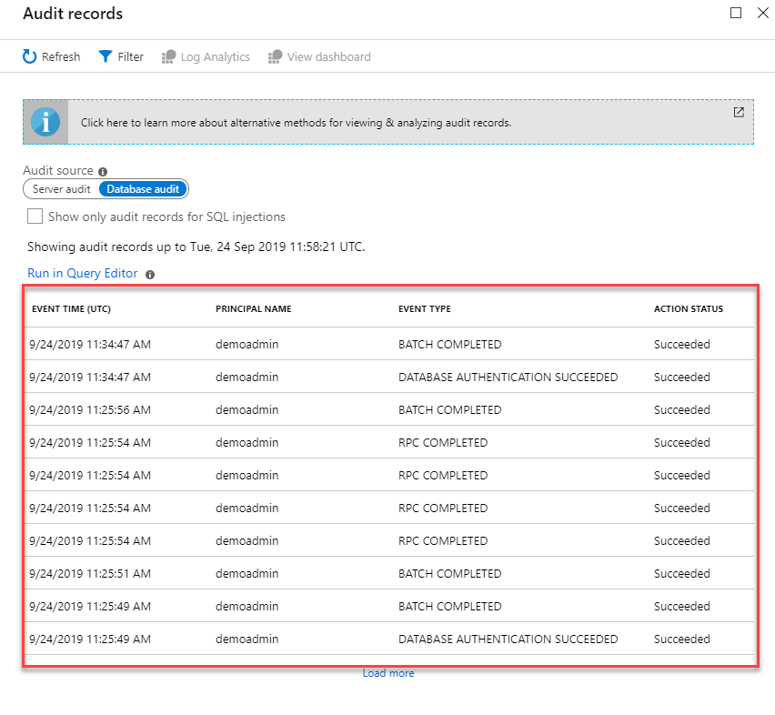

### Task 4: Threat Protection 
1. Open Resource Group with suffix **-SQL**, navigate to the SQL Server. Select **Advanced Data Security** under Security.
2. Use the following configurations:
* Advanced Data Security: **On**
* Subscription: **Choose your subscription**
* Storage Account: **Choose your storage account**
* Periodic recurring scans: **On**
* Send scan reports to: **username**
* Send Alerts to: **username**

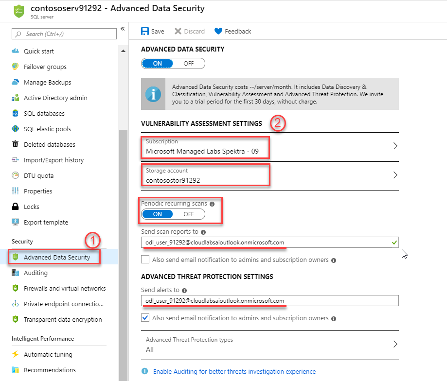

3. Select **Save**.

### Task 5: Configure SQL Data Discovery and Classification

In this task, you will look at the SQL Data Discovery and Classification feature that introduces a new tool for discovering, classifying, labeling & reporting the sensitive data in your databases. It introduces a set of advanced services, forming a new SQL Information Protection paradigm aimed at protecting the data in your database.

1. Go to SQL Database, on the **Advanced Data Security** blade, select the **Data Discovery & Classification** tile.

2. In the Data Discovery & Classification blade, select the info link with the message **We have found 16 columns with classification recommendations**.

3. Look over the list of recommendations to get a better understanding of the types of data and classifications that can be assigned, based on the built-in classification settings.
4. Check the **Select all** check box at the top of the list to select all the remaining recommended classifications, and then select **Accept selected recommendations**.

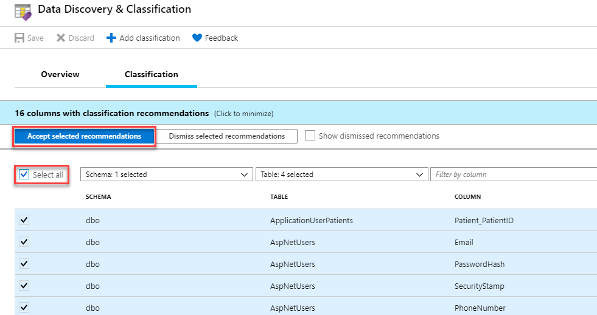

5. Select **Save**.
6. When the save completes, select the **Overview** tab on the Data Discovery & Classification blade to view a report with a full summary of the database classification state.

7. To check how this works in respect to the app service, will go to the app service **contosoapp-suffix**.
8. Select **Browse**, this will open **Contoso Clinic** webpage.

9. Now navigate to **Patients**. Then perform an operation by selecting **Details** of any patient where this will be reflected in the audit log in auditing. 

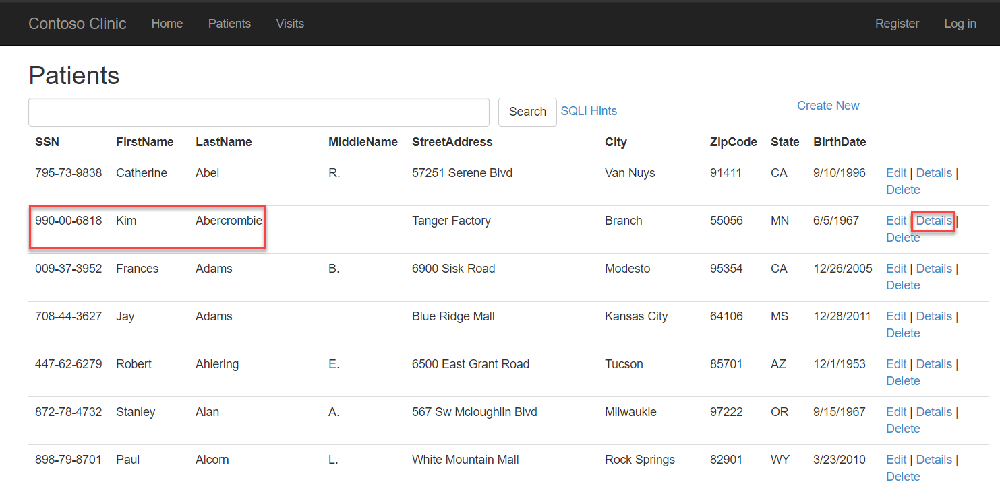

10. The actions performed on the webpage will directly get logged into audit logs which can be reviewed. 
11. In SQL Database **Clinic**, select **Auditing** under **Security** where you can review the audit logs. Select **View Audit Logs**.

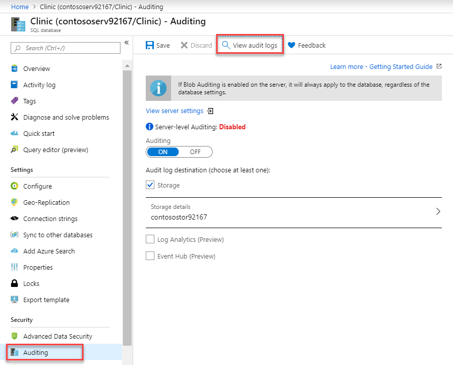 

12. You can review the recently happened activites.

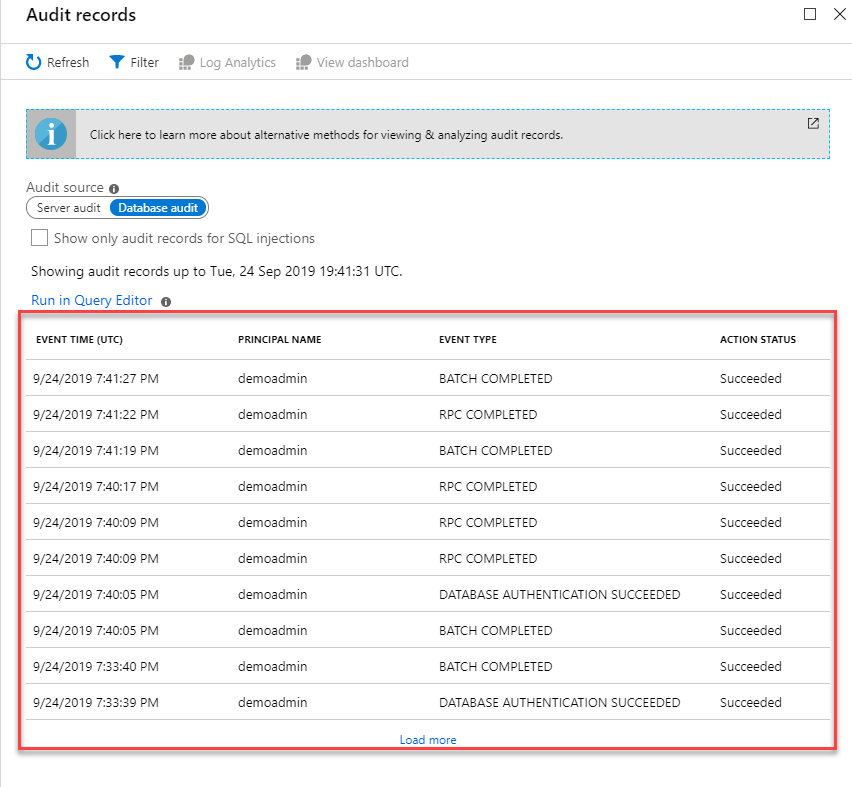

13. Then expand first activity, which will further show you details about the operation you performed in previous step (Step 9). It will refer to what kind of information is accessed.

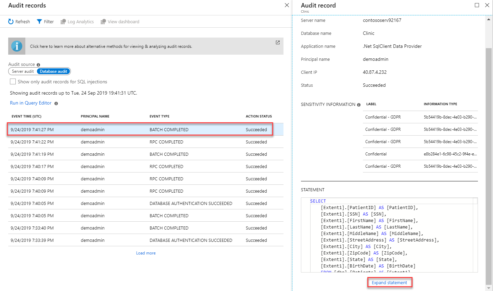

This is how one can review all the activites, that which application has access the confidential information.

### Task 6: Simulate Attack 

1.	In the Azure Portal, open Resource Group with suffix **-SQL**, navigate to the app service **contosoapp-suffix** and select **Browse**.

2.	You will be directed to **Contoso Clinic** webpage, select **Patients**, 

3.	In the **Search Box**, put the following code and  click on **Search**.
**' UNION SELECT '0', '1', '2', STUFF((select name from sys.tables FOR XML PATH('')),1,1,''), '4', '5', '6', '7', '8', '2010-10-10' --**

4. This will create an SQL Injection in the database.

5. You will receive an alert email regarding the threat, to review that navigate to https://portal.office.com.
6. Select **Outlook**.

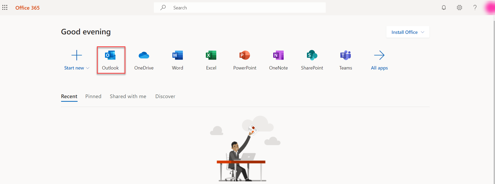

7. Then review the email which shows details about the threat.

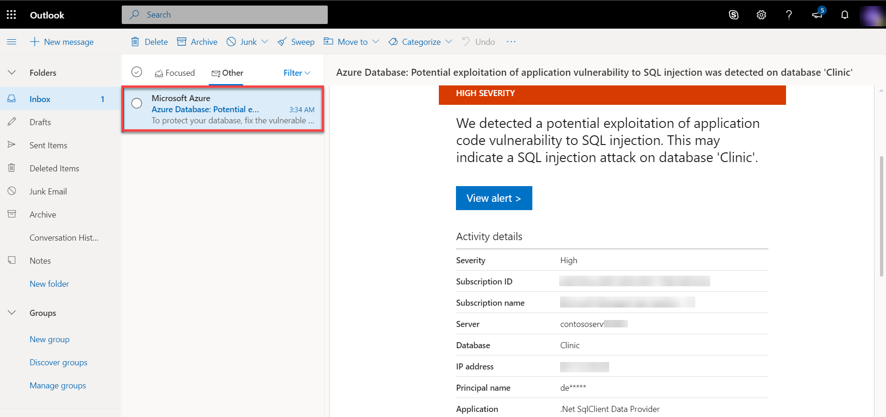

8.	Also, the threat can be reviewd from **Azure Portal**. To check through the portal, go to SQL Database **Clinic**.
9. Then go to **Advanced Data Security** under Security blade, select **Advanced Threat Protection**. Here you can review the threat.

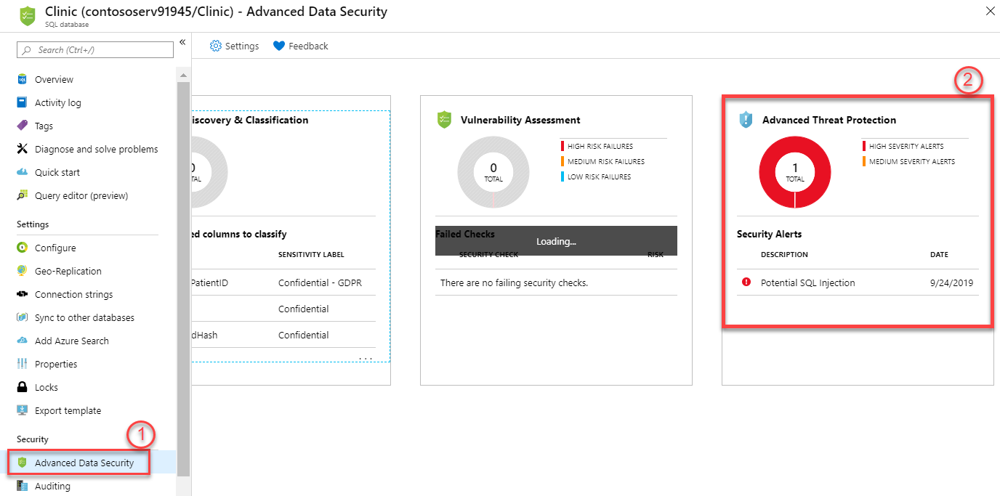
 
10. By selecting **Advanced Threat Protection**, you can review the threat as shown below in the image. Select the **Potential SQL Injcetion**.

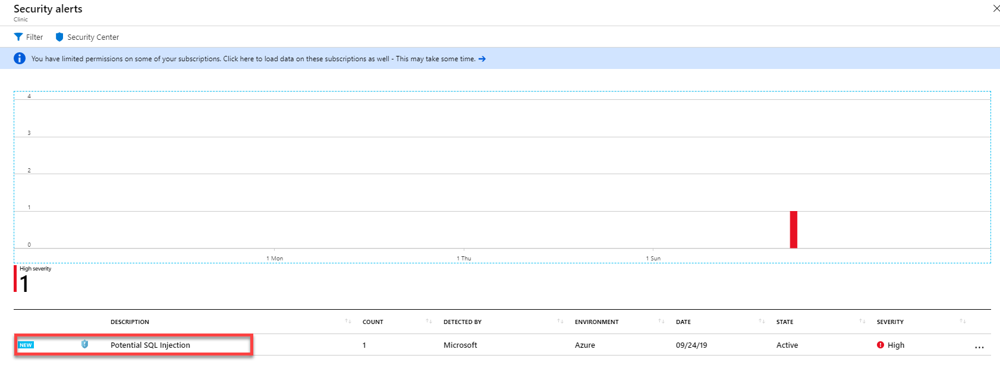

11. Here is the database in which threat is found. Select the sql database **Clinic**.

12. In this section you will get the information about threat.

### Task 7: Vulnerability Scan

In this task, you will review an assessment report generated by ADS for the `TailspinToys` database and take action to remediate one of the findings in the `TailspinToys` database. The [SQL Vulnerability Assessment service](https://docs.microsoft.com/azure/sql-database/sql-vulnerability-assessment) is a service that provides visibility into your security state, and includes actionable steps to resolve security issues, and enhance your database security. 

1. Return to the **Advanced Data Security** blade for the **Clinic** database and then select the **Vulnerability Assessment** tile.

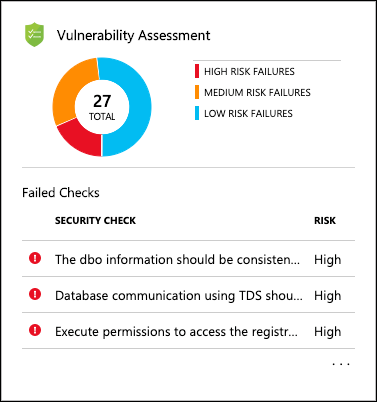

2. On the Vulnerability Assessment blade, select **Scan** on the toolbar.

3. When the scan completes, you will see a dashboard, displaying the number of failing checks, passing checks, and a breakdown of the risk summary by severity level.

 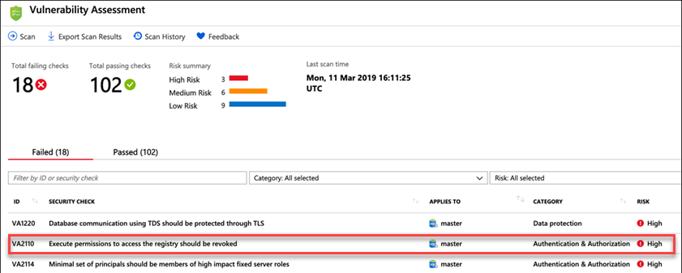

4. In the scan results, take a few minutes to browse both the Failed and Passed checks, and review the types of checks that are performed. In the **Failed** the list, locate the security check for **Transparent data encryption**. This check has an ID of **VA1219**.

5. Select the **VA1219** finding to view the detailed description.

### Task 8: Configure Dynamic Data Masking: 
 
In this exercise, you will enable Dynamic Data Masking (DDM). DDM limits sensitive data exposure by masking it to non-privileged users. This feature helps prevent unauthorized access to sensitive data by enabling customers to designate how much of the sensitive data to reveal with minimal impact on the application layer. It’s a policy-based security feature that hides the sensitive data in the result set of a query over designated database fields, while the data in the database is not changed.

1. Now navigating to SQL Database **Clinic** to add a mask.
2. Go to **Dynamic Data Masking** under **Security** blade, then select **+Add Mask**.

2. Use following configurations to create a mask rule:
* Schema: **dbo**
* Table: select **Patients** from dropdown
* Column: **SSN (char)** from dropdown

3. Select **Add**.
4. Add a mask again by selecting **+Add Mask**.
5.  Use following configurations:
* Table: select **Visits** from dropdown
* Column: **PatientID (int)** from dropdown
* Masking field format: **Number (random number range)**
* Enter random value for **To** and **For**.

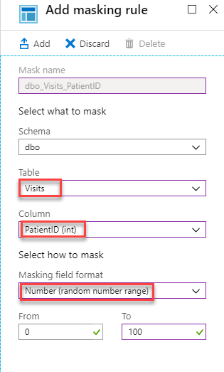

6. Then select **Add**. 
Your mask rules are ready.

### Task 9: Verify data how does it look by using App
1. Go back to your app service, select **Visits**.
**Verify data how does it look by logging in as non-admin user in SQL MGMT Studio**
